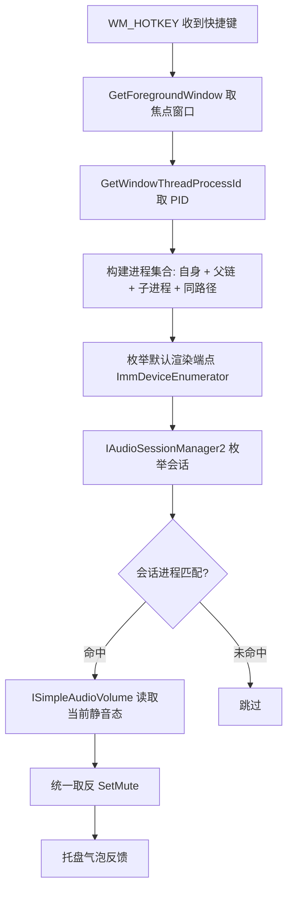

# EasyMute 技术可行性验证报告

| 项目       | 内容                              |
| ---------- | --------------------------------- |
| 验证结论   | ✅ 可行，无阻塞性风险             |
| 推荐技术栈 | C++17 + 原生 Win32/WASAPI（首选） |
| 备选技术栈 | Rust + windows-rs                 |
| 验证日期   | 2026-09-11                        |

---

## 1. 结论摘要

EasyMute 的全部核心能力均可由 Windows 长期稳定的原生 API 覆盖，且均为成熟方案：

| 能力         | 关键 API                   | 可用版本      |
| ------------ | -------------------------- | ------------- |
| 托盘图标     | Shell_NotifyIcon           | Windows 2000+ |
| 全局快捷键   | RegisterHotKey / WM_HOTKEY | Windows 2000+ |
| 焦点进程定位 | GetForegroundWindow 系列   | Windows 2000+ |
| 按应用静音   | WASAPI 音频会话（COM）     | Windows 7+    |
| 开机自启     | HKCU Run 注册表项          | 全版本        |
| 配置存储     | INI/JSON 文件              | 全版本        |

关键技术优势：

1. 无需内核驱动、无需键盘钩子、无需注入、无需管理员权限（默认）；
2. 纯事件驱动架构，无任何轮询，空闲 CPU 占用为 0；
3. 体积与内存可轻松达到"极度轻量"目标（exe ≤ 1MB，RAM ≤ 3MB）；
4. 仅依赖系统 DLL（ole32 / user32 / shell32），零第三方运行时依赖。

**结论：立项可行。** 建议先进行 1–2 天的核心技术 PoC（焦点进程 → 会话静音），再进入 MVP 开发。

## 2. 核心功能逐项技术验证

### 2.1 焦点窗口 → 应用进程定位（风险：低）

| 步骤         | API                                                                               |
| ------------ | --------------------------------------------------------------------------------- |
| 获取前台窗口 | `GetForegroundWindow()`                                                           |
| 获取进程 ID  | `GetWindowThreadProcessId()`                                                      |
| 获取进程路径 | `OpenProcess(PROCESS_QUERY_LIMITED_INFORMATION)` + `QueryFullProcessImageNameW()` |
| 获取进程树   | `CreateToolhelp32Snapshot(TH32CS_SNAPPROCESS)` 遍历 ParentProcessId 链            |

边界与对策：

- **UWP 应用**：前台窗口属于 `ApplicationFrameHost.exe` 宿主，需枚举其子窗口获取真实进程（`EnumChildWindows`）；
- **子进程发声**：焦点进程与创建音频会话的进程不一致（部分游戏/Electron 应用）→ 通过进程树 + 可执行文件路径双重匹配兜底；
- **权限**：读取其他进程的 PID / 路径不需要管理员权限。

### 2.2 静音控制：WASAPI 音频会话（风险：中，最关键）★

调用链：

```
IMMDeviceEnumerator
  └─ GetDefaultAudioEndpoint(eRender, eMultimedia/eConsole)
      └─ Activate(IID_IAudioSessionManager2)
          └─ GetSessionEnumerator()
              └─ 逐个 IAudioSessionControl2
                  ├─ GetProcessId()         // 匹配进程
                  ├─ GetSessionIdentifier() // 会话标识（含进程路径，兜底匹配）
                  └─ QueryInterface(ISimpleAudioVolume)
                      ├─ GetMute()
                      └─ SetMute(bool)      // ★ 即"音量合成器中的静音开关"
```

匹配与切换策略（保证多会话一致性）：

1. 会话进程 PID == 焦点进程 PID；
2. 否则：会话进程与焦点进程处于同一进程树（父子链任一方向）；
3. 否则：会话标识中的可执行文件路径 == 焦点进程路径（覆盖浏览器多进程等场景）；
4. 命中的全部会话：读取当前静音状态（全部已静音 = 已静音）→ 统一取反 `SetMute`。

边界与对策：

- 目标应用无会话：直接提示"当前应用没有音频输出"；
- **音频设备热插拔 / 默认设备切换**：不做常驻监听，每次按键现场重新枚举默认端点（耗时 1–3ms，可忽略），天然自愈；
- 权限：同一登录会话下控制其他进程的音频会话不需要管理员；
- 已知限制：极少数使用"独占模式（Exclusive Mode）"直写硬件的应用不受会话音量控制（场景罕见，文档标注即可）；
- 线程模型：`CoInitializeEx(COINIT_MULTITHREADED)`，按需同步调用，无回调、无常驻线程。

### 2.3 全局快捷键（风险：低–中）

- 方案：`RegisterHotKey(NULL, id, fsModifiers | MOD_NOREPEAT, vk)`，主线程消息循环中处理 `WM_HOTKEY`；`MOD_NOREPEAT` 防止长按连发。
- 修改快捷键：**先注册新键**并检测返回值（被占用时返回 `FALSE`），成功后再注销旧键，保证"改键失败不影响旧键"。
- 单键模式：`fsModifiers = 0` 时注册 F1–F24 / Pause / ScrollLock 可行；字母数字单键会把该键从全系统"吃掉"，故产品层禁止（见 PRD F2）。
- 录入方式：设置窗口内直接处理 `WM_KEYDOWN` + `GetKeyState` 采集修饰键状态，**无需键盘钩子**（避免杀软误报与 UIPI 限制）。
- 潜在风险与对策：
  - 个别全屏独占游戏 / 高权限窗口焦点下可能收不到热键（需实机验证）；
  - 兜底方案 A：提供"以管理员身份运行"选项（清单文件声明，用户手动选择）；
  - 兜底方案 B：降级启用低级键盘钩子 `WH_KEYBOARD_LL`（仅在确认必要场景时启用）。

### 2.4 托盘图标（风险：低）

- `Shell_NotifyIconW(NIM_ADD/NIM_MODIFY/NIM_DELETE, &nid)`；右键弹出原生菜单 `CreatePopupMenu` + `TrackPopupMenu`。
- 必须处理 `TaskbarCreated` 注册消息：资源管理器崩溃重启后重新 `NIM_ADD`，保证图标不消失。
- 图标资源：内嵌多尺寸 `.ico`（16/20/24/32/48/256），适配不同 DPI 缩放。
- 气泡通知：`NIF_INFO`（Win10/11 以系统通知形式呈现；专注助手开启时可能被折叠，属系统行为）。

### 2.5 开机自启（风险：低）

- 写 `HKCU\Software\Microsoft\Windows\CurrentVersion\Run`，值 = `"<exe完整路径>"`，普通权限即可；取消 = 删除该值。
- 每次启动时校验并刷新路径（防止程序被移动后失效）。
- 备选（如需延迟启动）：任务计划程序，本期不采用。

### 2.6 单实例与实例唤起（风险：低）

- `CreateMutexW(NULL, FALSE, L"EasyMute.SingleInstance")`，`GetLastError() == ERROR_ALREADY_EXISTS` 判定重复启动；
- 新实例通过 `RegisterWindowMessage` 自定义消息通知已有实例打开设置窗口，然后自行退出。

### 2.7 配置持久化（风险：低）

- `%APPDATA%\EasyMute\config.ini`，使用系统 API `GetPrivateProfileStringW` / `WritePrivateProfileStringW`，零第三方依赖。
- 示例：

```ini
[Hotkey]
Modifiers=Ctrl+Alt
Key=M
[General]
AutoStart=1
ShowNotification=1
```

### 2.8 高 DPI 与多显示器（风险：低）

- `SetProcessDpiAwarenessContext(DPI_AWARENESS_CONTEXT_PER_MONITOR_AWARE_V2)`；
- 托盘与设置窗口按 `WM_DPICHANGED` 响应缩放。

## 3. 技术栈选型对比

| 方案              | 语言/框架                     | exe 体积                     | 常驻内存 | 启动速度 | 开发成本 | 风险 | 评价                                    |
| ----------------- | ----------------------------- | ---------------------------- | -------- | -------- | -------- | ---- | --------------------------------------- |
| **A. 原生 Win32** | C++17（MSVC + WASAPI）        | 0.15–1MB                     | 1–3MB    | <50ms    | 中高     | 低   | ✅ 首选：最贴合"极度轻量"               |
| **B. Rust 原生**  | Rust + windows-rs             | 1–4MB                        | 2–5MB    | <100ms   | 中       | 低   | ✅ 强推备选：内存安全、易维护           |
| C. C# WinForms    | .NET 8 + NAudio               | 自包含 60–100MB / 依赖运行时 | 25–60MB  | 1–3s     | 低       | 低   | ❌ 体积/内存不达标                      |
| D. WinUI 3        | C# + Windows App SDK          | 更重且需运行时               | 高       | 慢       | 中       | 中   | ❌ 重量级，方向相反                     |
| E. Python         | pystray + pycaw + PyInstaller | 10–30MB                      | 30–80MB  | 2–5s     | 低       | 中   | ❌ 仅适合原型验证                       |
| F. Tauri          | Rust + WebView2               | 5–15MB                       | 30–80MB  | 数百 ms  | 中       | 中   | ❌ 对小工具过重，且依赖 WebView2 运行时 |

选型结论：

- 追求**极致体积**选方案 A（C++ 原生），本报告后续以 A 为基准给出实现方案；
- 追求**开发体验与内存安全**、可接受 ~2MB 体积选方案 B（Rust + windows-rs）；
- 方案 C/E 仅适合快速原型验证，不满足"极度轻量"硬指标。

## 4. 推荐实现方案（方案 A：C++ 原生）

### 4.1 模块架构

| 模块             | 职责                     | 关键 API                         |
| ---------------- | ------------------------ | -------------------------------- |
| `main.cpp`       | 入口、单实例、消息循环   | WinMain, CreateMutex             |
| `TrayIcon`       | 托盘图标、右键菜单、气泡 | Shell_NotifyIcon, TrackPopupMenu |
| `HotkeyManager`  | 注册/变更/注销全局热键   | RegisterHotKey, WM_HOTKEY        |
| `AppResolver`    | 焦点窗口 → 进程树 → 路径 | GetForegroundWindow, Toolhelp32  |
| `AudioMute`      | 会话枚举与静音切换       | WASAPI（COM）                    |
| `SettingsWindow` | 设置界面、按键采集       | Win32 窗口                       |
| `Config`         | 配置读写                 | INI API                          |
| `AutoStart`      | 注册表启动项             | RegSetValueEx                    |

架构特点：**单线程 + 消息循环**，全部动作按需触发，无常驻线程、无定时器。

### 4.2 关键流程（按一次快捷键）



### 4.3 编译与体积优化

- 工具链：Visual Studio Build Tools（MSVC）+ CMake（可选 MinGW-w64 备选）；
- 编译开关：`/O2 /GL /LTCG`、静态链接 CRT（`/MT`）、`/DNDEBUG`、剥离调试信息；
- 链接库：`ole32.lib user32.lib shell32.lib advapi32.lib gdi32.lib`；
- 体积预期：Release 版 exe 约 150KB–500KB（不含图标资源）；
- 不建议使用 UPX 等壳：会显著提高杀软误报率。

### 4.4 验证建议（PoC 清单）

| 序号 | 验证项                              | 通过标准                               |
| ---- | ----------------------------------- | -------------------------------------- |
| 1    | 焦点浏览器（Chrome/Edge）→ 按快捷键 | 音量合成器中该条目变为静音，声音消失   |
| 2    | 再次按键恢复                        | 声音恢复，合成器状态还原               |
| 3    | 微信 / QQ / 音乐播放器              | 同上                                   |
| 4    | UWP 应用（如"电影和电视"）          | ApplicationFrameHost 子窗口映射正确    |
| 5    | 多会话场景（浏览器多进程发声）      | 全部会话状态一致切换                   |
| 6    | 全屏游戏 / 管理员窗口               | 快捷键是否触发（决定是否需要兜底方案） |
| 7    | 设备热插拔（插拔耳机）              | 再次按键功能正常                       |
| 8    | 长按快捷键                          | 不连续触发（MOD_NOREPEAT 生效）        |

## 5. 风险清单与对策

| #   | 风险                              | 概率  | 影响         | 对策                                                                  |
| --- | --------------------------------- | ----- | ------------ | --------------------------------------------------------------------- |
| 1   | 焦点进程 ≠ 发声进程               | 中    | 功能失效     | 进程树 + 路径三重匹配；覆盖已知案例                                   |
| 2   | 快捷键被占用 / 被系统吞掉         | 中    | 用户困惑     | 设置不拦截；注册失败保留旧键、托盘提示标注"未生效"（2026-09-11 变更） |
| 3   | 全屏独占游戏 / 管理员窗口热键失灵 | 低-中 | 特定场景失效 | 实机验证；兜底：管理员运行 / 低级键盘钩子                             |
| 4   | 独占音频模式应用不受控            | 低    | 个别应用无效 | 文档标注；此类应用罕见                                                |
| 5   | 杀软误报                          | 低    | 无法使用     | 不注入、不挂钩子、不联网；可选代码签名                                |
| 6   | 未签名 exe 触发 SmartScreen       | 中    | 首次安装摩擦 | 文档提示"仍要运行"；可选购买证书                                      |
| 7   | 多实例 / 残留进程                 | 低    | 体验问题     | 单实例互斥 + 退出清理                                                 |

## 6. 测试与验收计划

- 环境矩阵：Windows 10 22H2（x64）/ Windows 11 23H2+（x64）；
- 音频设备：扬声器 / 蓝牙耳机 / USB 声卡分别验证；
- 目标应用样本：Chrome、Edge、微信、QQ、QQ音乐、Spotify、Steam 游戏、UWP 应用；
- 性能：任务管理器 & Process Explorer 观察 24 小时内存曲线；用 `Measure-Command` 测启动耗时；
- 冲突专项：改动快捷键失败时旧键仍工作；
- 回归：explorer 重启、音频设备切换、休眠唤醒后功能自恢复。

## 7. 结论

1. **技术可行**：全部核心功能均有系统原生 API 支持，无需驱动、钩子与管理员权限，符合"极度轻量化"的硬性要求；
2. **推荐路径**：C++17 原生 Win32/WASAPI 实现（单文件 ≤ 1MB、内存 ≤ 3MB）；备选 Rust + windows-rs；
3. **建议动作**：先执行 4.4 节 PoC 清单（1–2 天），重点验证第 4/5/6 项；通过后进入 MVP 开发（约 5–8 人日）；
4. **发布准备**：绿色单文件为主，必要时补充代码签名与安装包以降低 SmartScreen 摩擦。

## 8. 核心链路验证记录（2026-09-11，v1.0.0）

已在 Windows 11（x64，Realtek 扬声器）上完成真实硬件端到端验证，全部通过：

| #   | 验证项              | 方式                                   | 结果                                                    |
| --- | ------------------- | -------------------------------------- | ------------------------------------------------------- |
| 1   | 会话枚举            | `easymute_selftest.exe list`           | ✅ 正确列出系统全部音频会话（系统声音、浏览器、游戏等） |
| 2   | 进程匹配            | 对测试桩进程执行                       | ✅ `easymute_soundstub.exe` 精确命中其音频会话          |
| 3   | 会话静音 / 恢复     | 两次切换（净效果还原）                 | ✅ 「已静音」→「已恢复」                                |
| 4   | 全局热键注册 / 释放 | 运行期间从外部进程抢占同名组合         | ✅ 注册成功；进程退出后组合被释放                       |
| 5   | **真实按键端到端**  | 向焦点测试进程发送 `Ctrl+Alt+F9`       | ✅ 第一次按键静音、第二次恢复                           |
| 6   | 单实例互斥          | 重复启动                               | ✅ 第二实例自动退出                                     |
| 7   | 构建产物            | MinGW-w64 GCC 16.1 + CMake 4.4 + Ninja | ✅ `EasyMute.exe` ≈ 0.80 MB，无第三方运行时依赖         |

工程实现过程中的三个关键经验（可作后续参考）：

1. 窗口过程在 `WM_NCCREATE` / `WM_CREATE` 阶段必须使用回调传入的 `hwnd` 参数调用 `DefWindowProc`（此时成员 `hwnd_` 尚未赋值，使用成员会导致窗口创建失败）；
2. 快捷键录入控件必须先保存候选组合再通知父窗口（曾漏掉该步，导致父窗口反复注册旧键、任何改键都提示"被占用"）；
3. 调试辅助：设置环境变量 `EASYMUTE_DEBUG=1` 输出内部调试日志（`%TEMP%\easymute_debug.log`）；`easymute_soundstub.exe` 可制造真实音频会话用于验证。

备注：开发机上默认组合 `Ctrl+Alt+M` 已被其他软件占用（属既成事实）。按 2026-09-11 需求变更，程序不再提示 / 拦截"被占用"，而是接受设置并在托盘提示标注"（未生效）"；实测使用无冲突的 `Ctrl+Alt+F9` 完成全部验证。

发布前待完成：全屏独占游戏 / 管理员窗口的热键触发实测、蓝牙耳机热插拔、UWP 应用样本、长时间内存观测。
